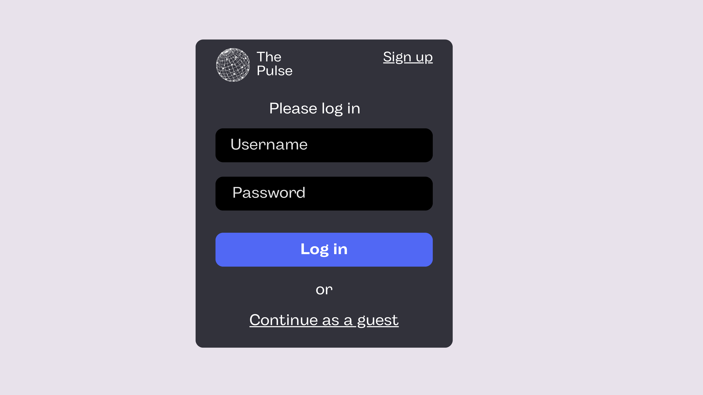
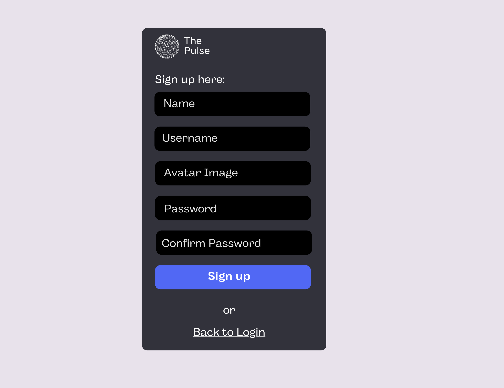
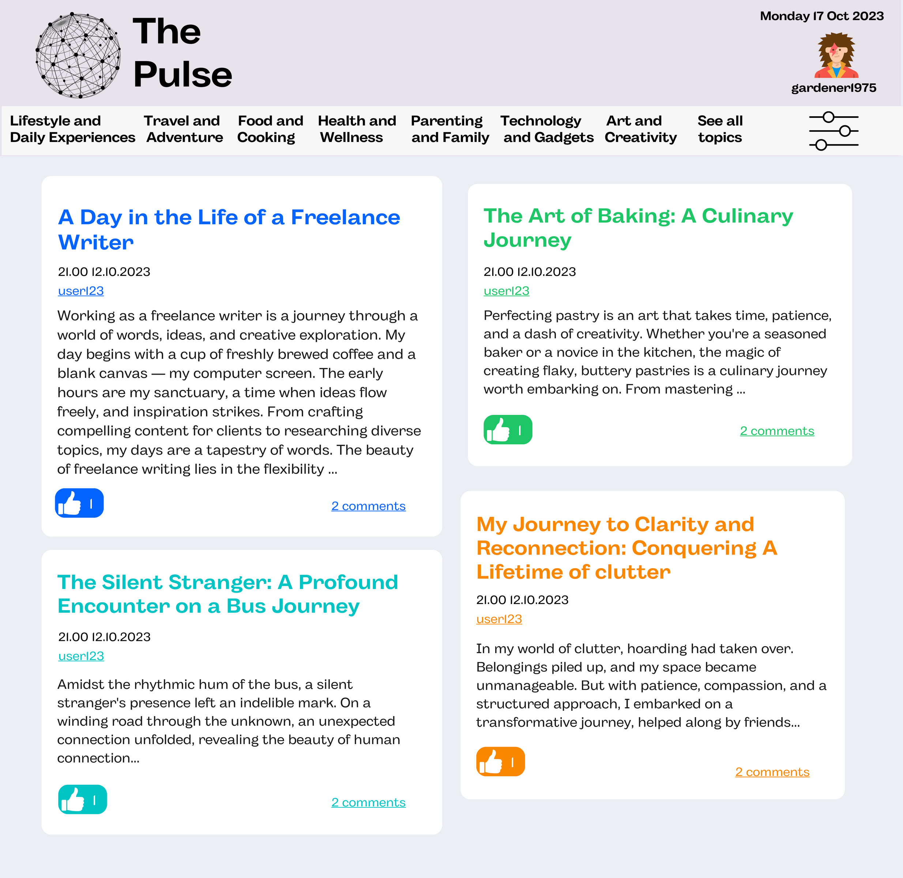
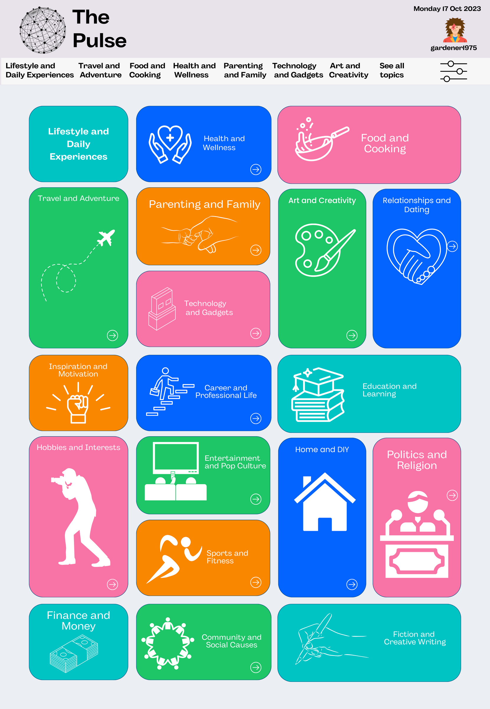
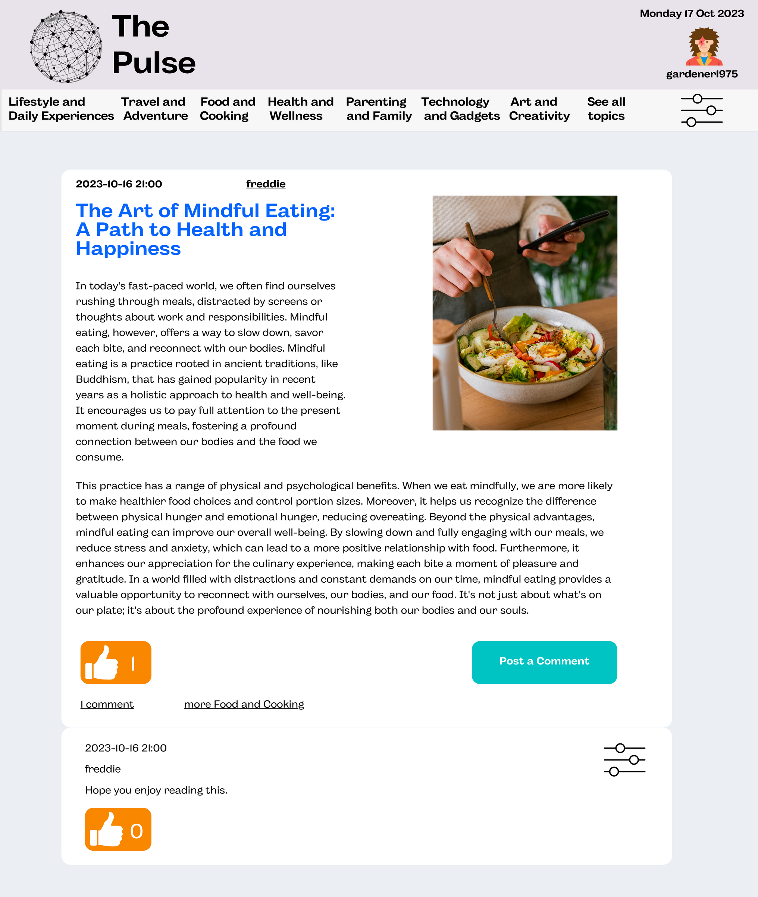
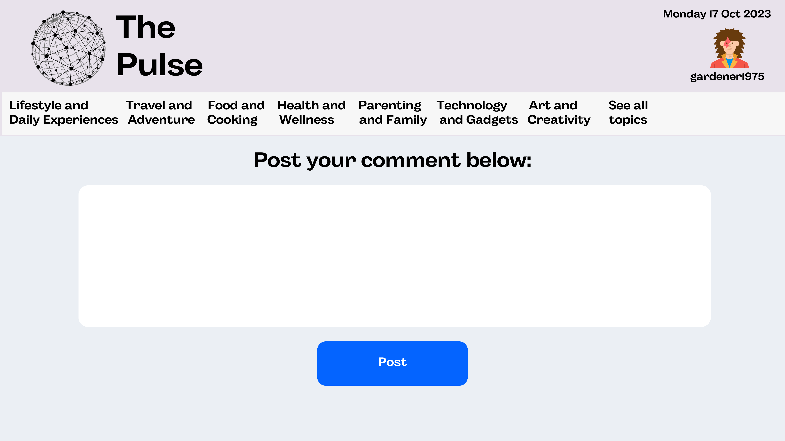
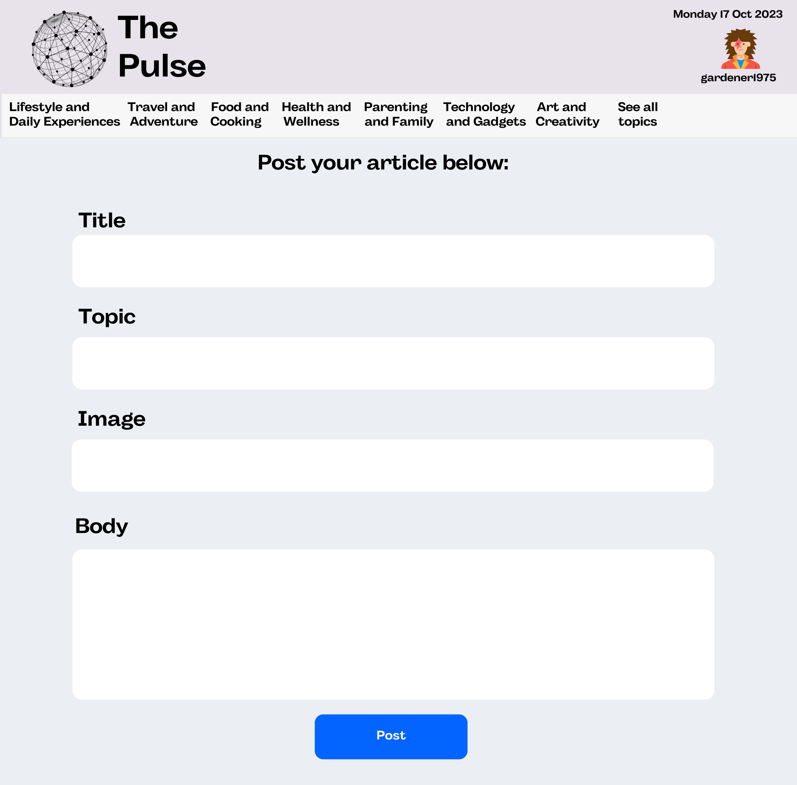
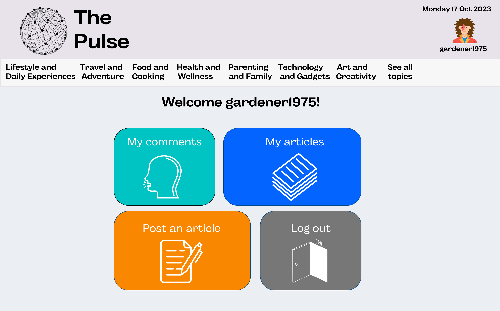

# The Pulse

## Introduction 

The Pulse is a news and social platform, with the aim of creating a hub for users to connect while posting short news articles and viewpoints on the things that interest them. The app aims to be smaller in scale than national news sites and is more focussed on connecting users, than on the content they may be connecting over.

It is analogous to a friendly Discord server, where the users help craft their own experience by interacting with the site and making it their own. The Pulse has more detail than tweets on Twitter and is more personal than BBC News.

I chose to build a news and social app, because I am interested in the news and how we communicate information. This project is an updated version of the frontend final bootcamp project I completed with Northcoders. It is the first app I built from start to finish.

The deployed app: https://nc-news-rvallely.netlify.app/ 

## Backend

The backend repo for this application: https://github.com/rvallely/ncNewsApp .  TODO
  
The hosted API of this back-end project: https://rosie-nc-news-app.herokuapp.com/api. TODO

Using the endpoints and the 'queries' and 'params' listed for each endpoint on the hosted API, you can change the URL and access data in the database.

To parse the data and make it more readable, you may want to download a JSON formatting extension for your browser such as: https://chrome.google.com/webstore/detail/json-formatter/bcjindcccaagfpapjjmafapmmgkkhgoa.

## Planning

I began by designing my application.   

## User Stories

As a user I should be able to:  
  
1. view a list of all the articles
2. view a page for each topic with a list of related articles
3. view an individual article
4. view an article's comments
5. vote on an article and immediately see the change
6. post a new comment to an existing article
7. sort articles by:  
. date created  
. comment count  
. votes
8. delete my own comments TODO
9. see an appropriate error if I go to a non existent path or a path for a non existent article or topic TODO
10. not be able to post a comment if I haven't filled in all of the form boxes
11. be able to use the site on my mobile or laptop without sacrificing functionality
12. vote on a comment and immediately see the change
13. view a list of all articles written by any specific user
14. post a new article to an existing topic
15. delete my own articles TODO
16. sort comments by most recent and most votes
16. login with a correct username and password
17. only be able to vote once per page load on any vote button
18. sign up as a new user
19. update the body of my own articles TODO
20. update the body of my own comments TODO

## What I Learned

I learned that there is a basic visual language of user interfaces online. Looking at large news organisations and social media platforms there are similar visual rules with the location and appearance of a site or an application including layout, features, buttons and how it is indicated to a user that a feature is interactive or not. 

There's a sense, when on most sites, that you know where to go and what certain symbols mean. I tried to follow these rules to make The Pulse as easy and inviting to interact with for a user, by keeping it in a format they were used to.

There seems to be a move to simplicity, maybe because people spend such a lot of time on smaller smart phone screens now. Login forms have placeholders rather than labels and are less crowded. I noticed buttons on YouTube and Facebook fill in when pressed. 

My designs were useful, as were the user stories, as they structured tasks in a way that wasn't overwhelming. Having a general idea of how the app was going to look allowed me to work to that plan and not have to design at the same time as making requests to my server and building components. I found it easier to do one type of job at a time.

## Future Features  
  
  In the future I'd like to:  
    
. have a top users feature from a most commented on or upvoted article of the day  
. have a way for users to report content that violated basic safeguarding rules  
. allow users to change their profile picture and update their password
    
## Technology

This project was written in JavaScript, HTML and CSS and with React.js.  
  
  Minimum requirements:  
  . `Node.js v18.16.0`

## Forking and cloning  

1. Fork this repository.
2. From the forked repository, click the blue 'Code' button and copy the HTTPS address to your clipboard.
3. From your command line navigate to an appropriate location and run `git clone <copied-HTTPS-address-of-repo-here>`. This will clone the project to your machine so it can be run locally.
4. Open the project on your machine and from the command line run `npm install` to install dependencies.

## Scripts

For the purpose of viewing The Pulse running `npm start` from 
the command line in the open project is sufficient.

